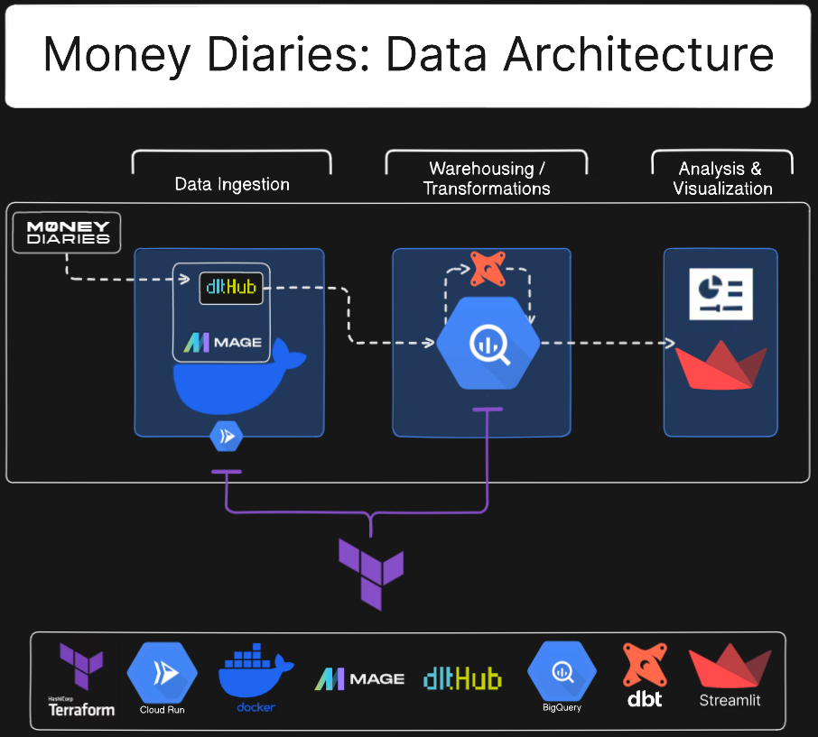
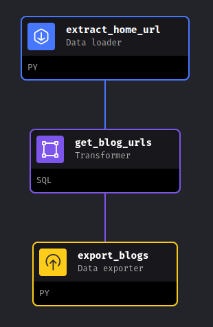
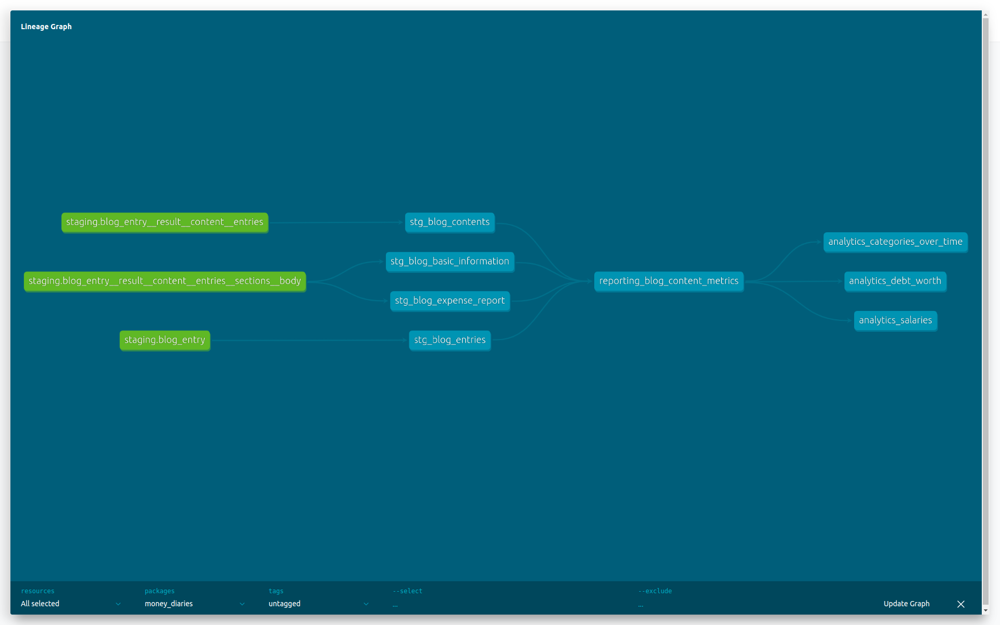
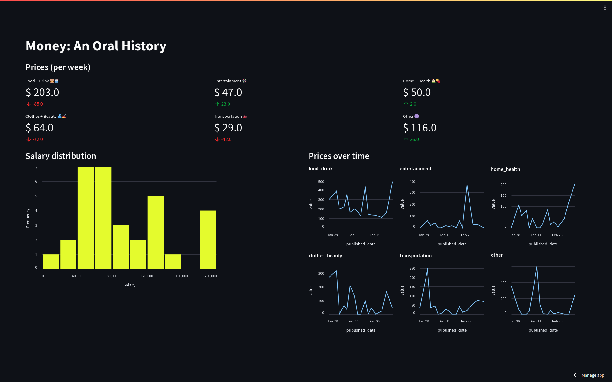
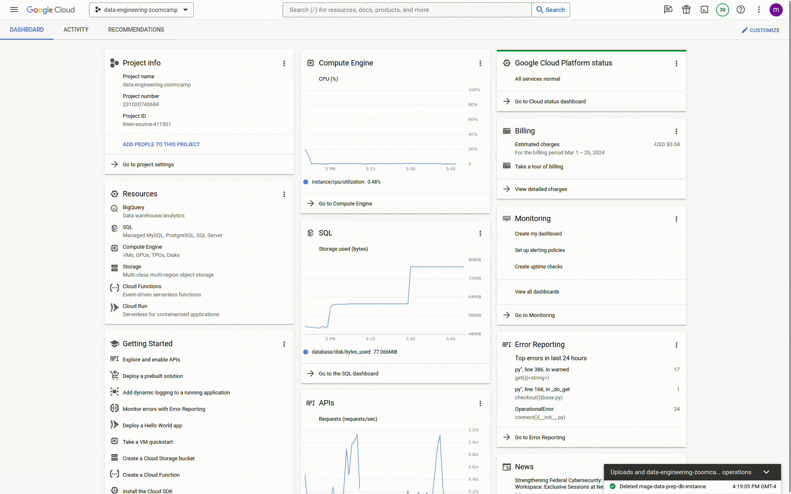
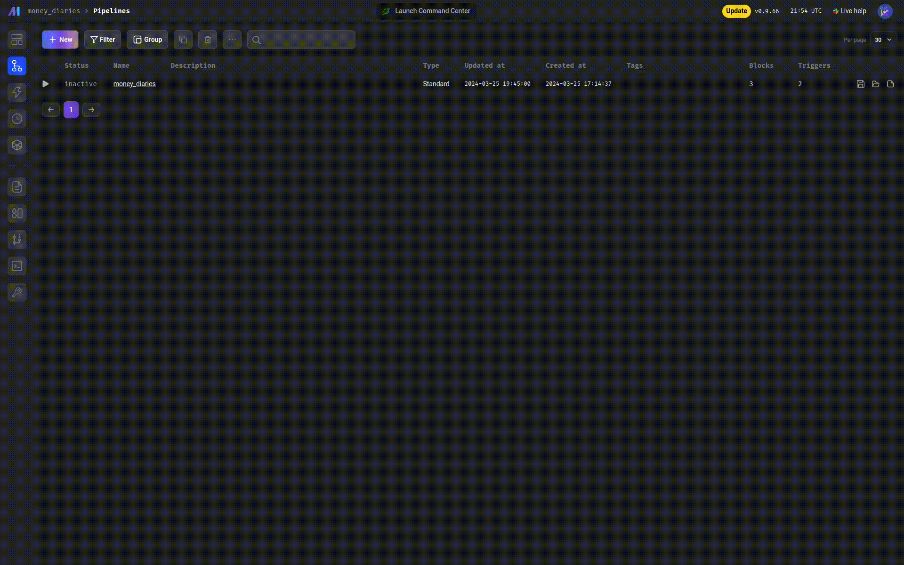
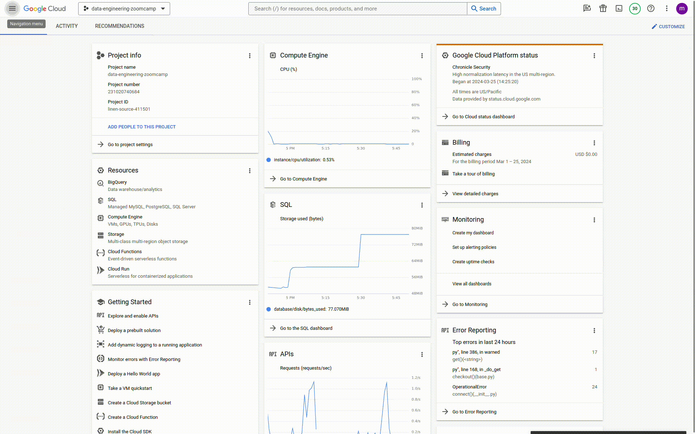

# Money Diaries

## Problem Description 
[Money Diaries](https://www.refinery29.com/en-us/money-diary) is a blog created in 2016 and hosted by the Refinery29 website. It comes out 3 times a week, where in each post an anonymous contributor writes about their money spending habits. All posts share a similar structure:
* The first section has information on the contributor's occupation, the industry they work in, their age, location, salary, net worth, debt, paycheck amount and cadence, and pronouns
* The second section covers their monthly expenses
* The third section is a list of background questions
* The fourth section is the diary, where the contributor tracks and shares their money spending for a week
* The fifth and final section is the breadkown, where all their spending is aggregated into six cateogries: Food & Drink, Home & Health, Clothes & Beauty, Entertainment, Transport, Other

The blog is a rich source of data for anyone who wants to learn about how money shapes our lives. I built a dashboard that summarizes some of the information in the blog such as salary distribution, prices over time, and debt vs. net worth. The dashboard can be accessed [here](https://moneydiaries.streamlit.app/).

#### Pipeline



...

## Cloud
The following cloud resources are provisioned using Terraform:
- Mage.ai 
- BigQuery dataset

See instructions in the Reproducibility section for details on how to deploy and run these resources.

## Data ingestion



Data is ingested using a pipelines are created in Mage.ai. 

The DAG steps are:
1. Scrap the blog's home page* and load it's json objects in BigQuery using `dlt`
2. Extract the blog urls from "diary_links__rows__entities" table
3. Scrap the blog posts and load their json contents in BigQuery using `dlt`

\* Note: Refinery29 webstie's robot.txt file has no explicit restrictions on scrapping the Money Diaries blog posts. You can check it [here](https://www.refinery29.com/robots.txt)

## Data warehouse

The ingested data is stored in a BigQuery data warehouse. DBT is used to create optimized versions of the tables that host the data that will be used by the dashboard.

DBT supports paritioning and clustering for BigQuery using the following format:

```lua
{{ config(
    materialized="incremental",
    partition_by={
      "field": "created_date",
      "data_type": "timestamp",
      "granularity": "day",
      "time_ingestion_partitioning": true
    }, 
    cluster_by = ["customer_id", "order_id"]
) }}

select
  user_id,
  event_name,
  created_at,
  -- values of this column must match the data type + granularity defined above
  timestamp_trunc(created_at, day) as created_date

from {{ ref('events') }}
```

## Transformations



Data transformation is handled by DBT. There are 3 stages:
1. Staging: The four tables that will stage the data for the dashboard are created and optimized (using clustering and partitioning) 
2. Core: The tables are joined together to create one source of truth table that will be used for reporting
3. Reporting: Three views are created to serve data to the dashboard charts

## Dashboard

[](https://moneydiaries.streamlit.app/)

The dashboard has the following charts:
* Number overlays showing ...
* Salary distribution histogram
* Debt-Net worth divergent bar chart
* Category prices over time line chart
* Inflation calculator

...

## Reproducibility

### Prerequisite

1. [GCloud](https://cloud.google.com/sdk/docs/install)
2. GCP account
3. [Docker](https://docs.docker.com/engine/install/)
4. [terraform](https://developer.hashicorp.com/terraform/tutorials/aws-get-started/install-cli)
5. [dbt](https://docs.getdbt.com/docs/core/connect-data-platform/bigquery-setup)

### Permissions

- Artifact Registry Read (mage)
- Artifact Registry Writer (mage)
- Cloud Run Developer (mage in the cloud) (try Cloud Run Admin instead) 
- Cloud SQL Admin (mage in the cloud)
- Service Account Token Creator (mage in the cloud)
- BigQuery Admin (BigQuery) # if needed 
- Cloud Vision AI Service Agent (Vision) # if needed
- Secret Manager Secret Accessor (mage) # if needed
- Vision AI Analysis Editor (Vision) # if needed
- Vision AI Application Editor (Vision) # if needed
- Service Usage Admin () # if needed
- Service Object Viewer () # if needed

...

### Run 

1. Clone the repo 


```bash
git clone https://github.com/el-grudge/money-diaries.git 
```

2. Export the following environment variables 

Change the values of the following environment variables or set them in the `variables.tf` file

```bash
export GOOGLE_PROJECT=[project-name]
export GOOGLE_PROJECT_ID=[project-id]
export GCP_REGION=[region]
export GCP_ZONE=[us-central1-c]
export GCP_LOCATION=[location]
export DB_PASSWORD=[database_password]
```

Note: The `DB_PASSWORD` parameter is for the Postgres database that will be used by Mage.ai's internal operations. The dashboard's data will be stored in a BigQuery dataset. 

1. Provision cloud resources with terraform

*OAUTH*
```bash
gcloud init
gcloud auth application-default login
```

*terraform init* 
```bash
cd terraform \
terraform init
```

*terraform plan*
```bash
terraform plan \
  -var="project=${GOOGLE_PROJECT}" \
  -var="project_id=${GOOGLE_PROJECT_ID}" \
  -var="region=${GCP_REGION}" \
  -var="zone=${GCP_ZONE}" \
  -var="location=${GCP_LOCATION}" \
  -var="database_password=${DB_PASSWORD}"
```

*terraform apply*
```bash
terraform apply \
  -var="project=${GOOGLE_PROJECT}" \
  -var="project_id=${GOOGLE_PROJECT_ID}" \
  -var="region=${GCP_REGION}" \
  -var="zone=${GCP_ZONE}" \
  -var="location=${GCP_LOCATION}" \
  -var="database_password=${DB_PASSWORD}"
```

Terraform will deploy Mage.ai as a Google Clound Run service, which you can access by navigating to the Cloud Run option on the left navigation menu. On the service details page, you'll find the URL of the running service listed under the "Service URL" section. Copy & go to this URL to find the Mage.ai service



Once inside Mage.ai service, you'll find the money_diaries pipeline already created. To run the pipeline, click on it to go the triggers page then press the Run@Once button, then the Run Now button in the Run Pipeline Now pop-up window. You can view the run's log by going to Run on the left navigation menu and clicking on the logs logo next to the Running pipeline



The pipeline will extract the blog posts from Money Diaries and load them into the BigQuery dataset called money_diaries, also provisioned by Terraform. You can view the dataset by navigating to BigQuery on the left navigation menu, then click on BigQuery Studio. Once the Explorer loads, expand the project containing your dataset to list all datasets



To delete these resources, run the `terraform destroy` command:

*terraform destroy*
```bash
terraform destroy \
  -var="project=${GOOGLE_PROJECT}" \
  -var="project_id=${GOOGLE_PROJECT_ID}" \
  -var="region=${GCP_REGION}" \
  -var="zone=${GCP_ZONE}" \
  -var="location=${GCP_LOCATION}" \
  -var="database_password=${DB_PASSWORD}"
```

Note: Sometimes resources take a bit too long to be destroyed, which may interrupt the destroy operation. If you see an error such as "role 'xyz' cannot be dropped because some objects depend on it" or "'resource' is still in use", wait a few minutes then rerun the `terraform destroy` command.

2. DBT

... might not be needed, confirm in testing phase
```bash
gcloud auth application-default login \
  --scopes=https://www.googleapis.com/auth/bigquery,\
https://www.googleapis.com/auth/drive.readonly,\
https://www.googleapis.com/auth/iam.test
```

```bash
dbt init
```

```bash
dbt deps
```

```bash
dbt build
```

3. Dashboard

Rename the streamlit directory

```bash
mv streamlit .streamlit
```

The .streamlit directory has the secrets.toml file which contains the Google cloud credentials that will be used to connect to BigQuery.

Modify the contents of the key file by adding the values from the keys JSON file

```
# .streamlit/secrets.toml

[gcp_service_account]
type = "service_account"
project_id = "xxx"
private_key_id = "xxx"
private_key = "xxx"
client_email = "xxx"
client_id = "xxx"
auth_uri = "https://accounts.google.com/o/oauth2/auth"
token_uri = "https://oauth2.googleapis.com/token"
auth_provider_x509_cert_url = "https://www.googleapis.com/oauth2/v1/certs"
client_x509_cert_url = "xxx"
```

Now, the dashboard can be launched by running the following command:

```bash
streamlit run streamlit-moneydiaries/app.py
```

To view the dashboard, go to https://localhost:8501
