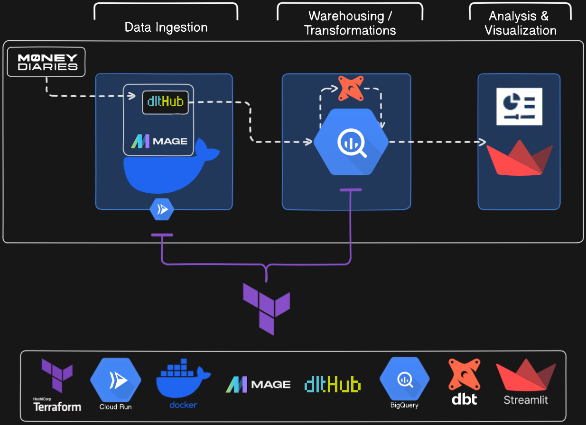
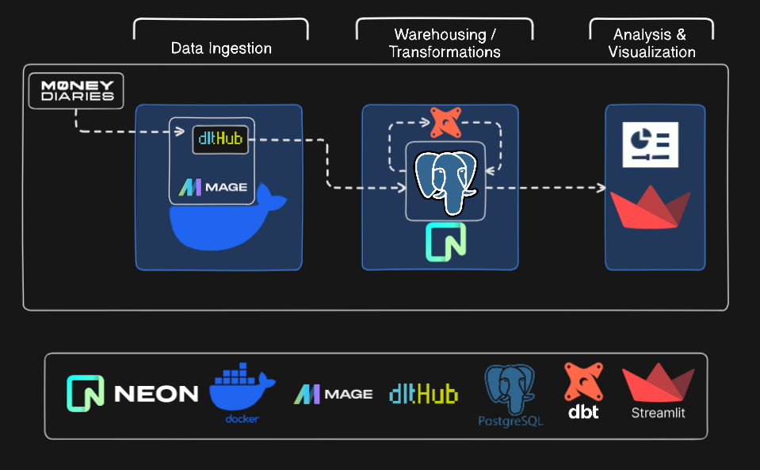
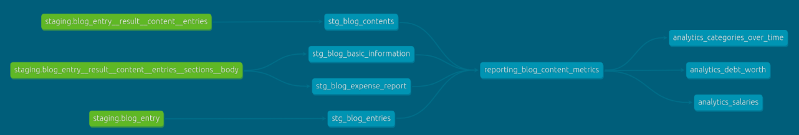
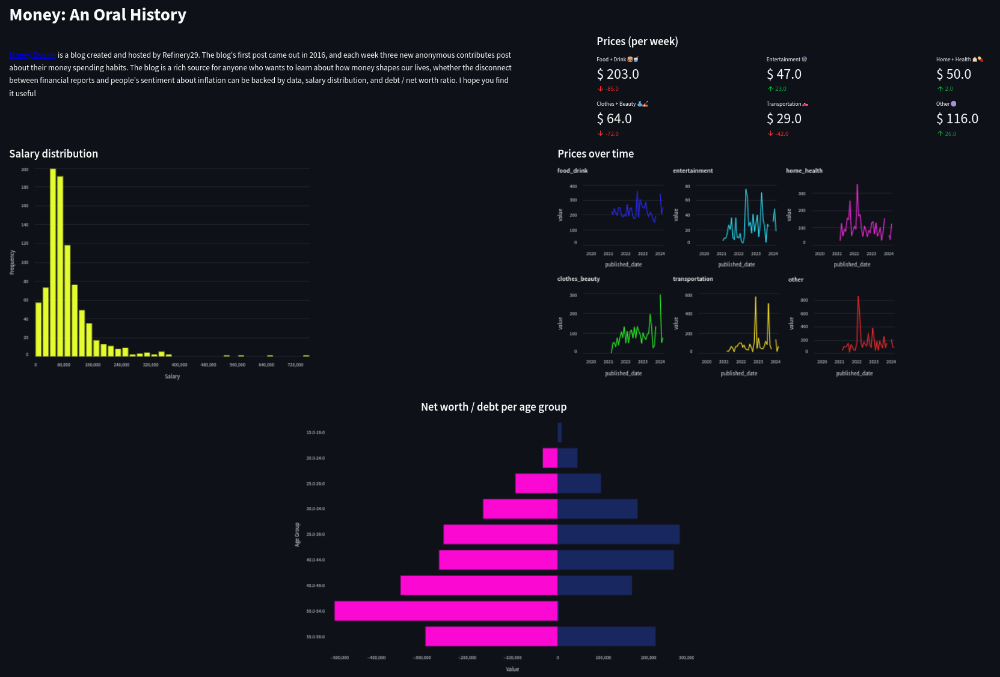
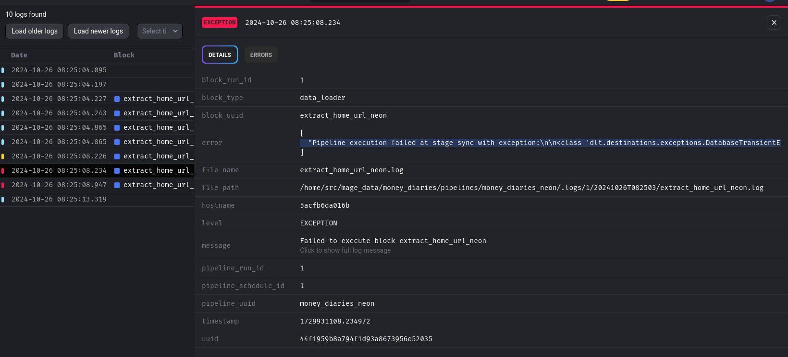

# Money Diaries

## Problem Description 
[Money Diaries](https://www.refinery29.com/en-us/money-diary) is a blog created and hosted by Refinery29. The blog's first post came out in 2016, and each week three new anonymous contributes post about their money spending habits. All posts have a similar structure:
* The first section has information on the contributor's occupation, the industry they work in, their age, location, salary, net worth, debt, paycheck amount and cadence, and their pronouns
* The second section covers their monthly expenses
* The third section is a list of background questions
* The fourth section is the diary, where the contributor tracks and shares their spending for a week
* The fifth and final section is the breadkown, where all their spending is aggregated into six cateogries: Food & Drink, Home & Health, Clothes & Beauty, Entertainment, Transport, Other

The blog is a rich source of data for anyone who wants to learn about how money shapes our lives. I built a dashboard that summarizes some of the information in the blog such as salary distribution, prices over time, and debt vs. net worth. The dashboard can be accessed [here](https://moneydiaries.streamlit.app/).

### Data flow chart

#### BigQuery

When running the project with BigQuery, the data flow works as follows:

1. Terraform is used to deploy two resources: a Cloud Run Service and a BigQuery dataset
2. The Cloud Run services deploys a docker image that contains Mage.ai and dlt
3. The data is ingested from the blog using dlt and is stored in BigQuery
4. dbt is used to optimize and transform the data and to create three reporting views that will be used by the dashboard
5. The dashboard is built with Streamlit. It queries the reporting tables and visualizes the data

#### PostgreSQL on NEON

When running the project with PostgreSQL on NEON, the data flow works as follows:

1. The data is ingested from the blog using dlt and is stored in PostgreSQL
2. dbt is used to optimize and transform the data and to create three reporting views that will be used by the dashboard
5. The dashboard is built with Streamlit. It queries the reporting tables and visualizes the data

## Cloud
The following cloud resources are provisioned using Terraform:
- Mage.ai with dlthub
- BigQuery dataset

See instructions in the [Reproducibility](#Reproducibility) section for details on how to deploy and run these resources.

## Data ingestion

Data is ingested from the blog using a pipeline that is created in Mage.ai. The DAG steps are:
1. Scrap the blog's home page* and load it's json objects in BigQuery using `dlt`
2. Extract the blog urls from `diary_links__rows__entities` table
3. Scrap the blog posts and load their json contents in BigQuery using `dlt`

\* Refinery29 webstie's robot.txt file has no explicit restrictions on scrapping the Money Diaries blog posts. You can check it [here](https://www.refinery29.com/robots.txt)

## Data warehouse

The ingested data is stored in a BigQuery data warehouse. dbt transformations and optimizations access this warehouse, as well as the streamlit dashboard.

## Transformations

dbt is used to create optimized tables that host the data that will be used by the dashboard. For more details on how to partition and cluster tables in dbt check the [README](dbt/README.md) page under the dbt directory. 

Also, dbt creates three reporting views that will be used by the dashboard. 

The dbt pipeline involves three stages:
1. Staging: The four tables that will stage the data for the dashboard are created and optimized (using clustering and partitioning) 
2. Core: The tables are joined together to create one source of truth table that will be used for reporting
3. Reporting: Three views are created to serve data to the dashboard charts

## Dashboard

The dashboard has the following charts:
* Metric overlays showing average prices per category for the most recent month, with the delta from the month prior 
* Salary distribution histogram
* A line chart showing the average category prices per month over time 
* Debt-Net worth diverging bar chart

## Reproducibility

⚠️ Note: Before running these commands, please note that these resources are not free, Google Cloud will charge you for running these services. I recommend creating a new GCP account and using the free credits to run this pipeline. You can read more on Google Cloud billing [here](https://cloud.google.com/billing/docs/onboarding-checklist).

To recreate this dashboard, follow the instructions [here](./docs/instructions.md)

## Next steps

1. Create a streaming pipeline that extracts new posts
2. Create unit tests for all steps
3. Build a second pipeline that uses OCR to extract breakdown data (the scrapped data has a lot of null values)
4. Add filters and slicers to the dashoard
5. Use the stored data to build a financial RAG 
6. Store reactions to enrich the data

## Todo

- [ ] review the numbers
- [ ] ocr on mage
- [ ] move cpi to mage
- [ ] notes on [mage debugging](#debuging-mage)
- [ ] seed official inflation records
- [ ] use google ocr api to extract data from images when not available in scraped data
- [ ] modify dbt model to accommodate image extractions and inflation seeds
- [ ] data governance in dbt: 1- add metadata to enhance discoverability
- [ ] data governance in dbt: 2- add data quality checks to enhance data quality and integrity
- [ ] fix net worth regex on mage
- [ ] net worth calculation: use net worth if exists, else use assets to calculate net worth
- [x] move dbt to mage
- [x] use cpi code to calculate oral inflation
- [x] move debt-wealth chart to fig 1 
- [x] add official-vs-oral inflation chart
- [x] run the project on a longer period and ensure that it is working smoothly
- [x] fix net worth regex

#### debuging mage

fails when pipeline run with trigger
succeeds when executed step-by-step
unclear error message:

`"Pipeline execution failed at stage sync with exception:\n\n<class 'dlt.destinations.exceptions.DatabaseTransientException'>\nSSL SYSCALL error: EOF detected\n")`

