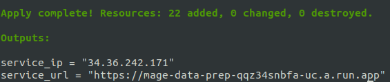

# Money Diaries

## Problem Description 
[Money Diaries](https://www.refinery29.com/en-us/money-diary) is a blog created and hosted by the Refinery29. The blog's first post came out in 2016, and each week there are 3 new posts. In each post an anonymous contributor writes about their money spending habits. All posts have a similar structure:
* The first section has information on the contributor's occupation, the industry they work in, their age, location, salary, net worth, debt, paycheck amount and cadence, and their pronouns
* The second section covers their monthly expenses
* The third section is a list of background questions
* The fourth section is the diary, where the contributor tracks and shares their spending for a week
* The fifth and final section is the breadkown, where all their spending is aggregated into six cateogries: Food & Drink, Home & Health, Clothes & Beauty, Entertainment, Transport, Other

The blog is a rich source of data for anyone who wants to learn about how money shapes our lives. I built a dashboard that summarizes some of the information in the blog such as salary distribution, prices over time, and debt vs. net worth. The dashboard can be accessed [here](https://moneydiaries.streamlit.app/).

### Data flow chart

The data flow works as follows:

1. Terraform is used to deploy two resources: a Cloud Run Service and a BigQuery dataset
2. The Cloud Run services deploys a docker image that contains Mage.ai and dlt
3. The data is ingested from the blog using dlt and is stored in BigQuery
4. DBT is used to optimize and transform the data and to create three reporting views that will be used by the dashboard
5. The dashboard is built with Streamlit. It queries the reporting tables and visualizes the data


## Cloud
The following cloud resources are provisioned using Terraform:
- Mage.ai with dlthub
- BigQuery dataset

See instructions in the [Reproducibility](#Reproducibility) section for details on how to deploy and run these resources.

## Data ingestion


Data is ingested from the blog using a pipeline that is created in Mage.ai. The DAG steps are:
1. Scrap the blog's home page* and load it's json objects in BigQuery using `dlt`
2. Extract the blog urls from "diary_links__rows__entities" table
3. Scrap the blog posts and load their json contents in BigQuery using `dlt`

\* Refinery29 webstie's robot.txt file has no explicit restrictions on scrapping the Money Diaries blog posts. You can check it [here](https://www.refinery29.com/robots.txt)

## Data warehouse

The ingested data is stored in a BigQuery data warehouse. dbt is used to create optimized versions of the tables that host the data that will be used by the dashboard. Also, dbt creates three reporting views that will be used by the dashboard. For more details, check the [README](../dbt/README.md) page under the dbt directory.

## Transformations


Data transformation is handled by dbt. The dbt pipeline involves three stages:
1. Staging: The four tables that will stage the data for the dashboard are created and optimized (using clustering and partitioning) 
2. Core: The tables are joined together to create one source of truth table that will be used for reporting
3. Reporting: Three views are created to serve data to the dashboard charts

## Dashboard

[](https://moneydiaries.streamlit.app/)

The dashboard has the following charts:
* Metric overlays showing average prices per category for the most recent month, with the delta from the month prior 
* Salary distribution histogram
* A line chart showing the average category prices per month over time 
* Debt-Net worth diverging bar chart

## Reproducibility

### Prerequisite

Make sure that the following tools are installed:

1. [GCloud](https://cloud.google.com/sdk/docs/install)
2. GCP account
3. [terraform](https://developer.hashicorp.com/terraform/tutorials/aws-get-started/install-cli)
4. [Docker](https://docs.docker.com/engine/install/)
5. [dbt](https://docs.getdbt.com/docs/core/connect-data-platform/bigquery-setup)

### Permissions

Make sure that the following permissions are granted to either your main GCP account or a service accout:

- Artifact Registry Read (mage)
- Artifact Registry Writer (mage)
- Cloud Run Developer (mage in the cloud) (try Cloud Run Admin instead) 
- Cloud SQL Admin (mage in the cloud)
- Service Account Token Creator (mage in the cloud)
- BigQuery Admin (BigQuery) # if needed 
- Secret Manager Secret Accessor (mage) # if needed

- Cloud Vision AI Service Agent (Vision) # if needed
- Vision AI Analysis Editor (Vision) # if needed
- Vision AI Application Editor (Vision) # if needed
- Service Usage Admin () # if needed
- Service Object Viewer () # if needed

...

### APIs

Make sure that the following APIs are enabled:

- Cloud Filestore API

<gif>

- Serverless VPC Access API

<gif>

...

### Run 

⚠️ Note: Before running these commands, please note that these resources are not free, Google Cloud will charge you for running these services. I recommend creating a new GCP account and using the free credits to run this pipeline. You can read more on Google Cloud billing [here](https://cloud.google.com/billing/docs/onboarding-checklist).

**1. Clone the repo**

```bash
git clone https://github.com/el-grudge/money-diaries.git
cd money-diaries
```
**2. Export the following environment variables**

Change the values of the following environment variables or set them in the `variables.tf` file

```bash
export GOOGLE_PROJECT="project-name"
export GOOGLE_PROJECT_ID="project-id"
export GCP_REGION="region"
export GCP_ZONE="zone"
export GCP_LOCATION="location"
export DB_PASSWORD="database_password"
```
ℹ️ Tip: The `DB_PASSWORD` parameter is for the Postgres database that will be used by Mage.ai's internal operations. This is different from the BigQuery data warehouse that will be used to store the data for the dashboard. 


**3. Provision cloud resources with terraform**


*OAUTH*
```bash
gcloud init
gcloud auth application-default login
```

*terraform init* 
```bash
cd terraform
terraform init
```

*terraform plan*
```bash
terraform plan \
  -var="project=${GOOGLE_PROJECT}" \
  -var="project_id=${GOOGLE_PROJECT_ID}" \
  -var="region=${GCP_REGION}" \
  -var="zone=${GCP_ZONE}" \
  -var="location=${GCP_LOCATION}" \
  -var="database_password=${DB_PASSWORD}"
```

*terraform apply*
```bash
terraform apply \
  -var="project=${GOOGLE_PROJECT}" \
  -var="project_id=${GOOGLE_PROJECT_ID}" \
  -var="region=${GCP_REGION}" \
  -var="zone=${GCP_ZONE}" \
  -var="location=${GCP_LOCATION}" \
  -var="database_password=${DB_PASSWORD}"
```

Terraform will deploy Mage.ai as a Google Clound Run service, and the `terraform apply` command will output the url to the mage service. 



In the `main.tf` file, access to the Mage.ai service is configured to accept external traffic by default. To disable external traffic navigate to the Cloud Run option on the left navigation menu, go the Networking tab, then choose ...

<gif>


When you go to the Mage.ai service url, you'll find the money_diaries pipeline already created. To run the pipeline, click on it, that will take to the triggers page, where you will find the Run@Once button. Press on it, then press on the Run Now button in the Run Pipeline Now pop-up window. You can view the log of the current run by going to Run on the left navigation menu and clicking on the logs logo next to the Running pipeline


The pipeline will extract the posts on the Money Diaries blog home page only. If you want to extract more posts, checkout the instructions in the terraform [README](../terraform/README.md) file. The pipeline loads the extracted data into a BigQuery dataset called money_diaries. You can view the dataset by navigating to BigQuery on the left navigation menu, then click on BigQuery Studio. Once the Explorer loads, expand the project containing your dataset to list all datasets


To delete these resources, run the `terraform destroy` command:

*terraform destroy*
```bash
terraform destroy \
  -var="project=${GOOGLE_PROJECT}" \
  -var="project_id=${GOOGLE_PROJECT_ID}" \
  -var="region=${GCP_REGION}" \
  -var="zone=${GCP_ZONE}" \
  -var="location=${GCP_LOCATION}" \
  -var="database_password=${DB_PASSWORD}"
```

⚠️ Note: Sometimes resources take a bit too long to be destroyed, which may interrupt the destroy operation. If you see an error such as "role 'xyz' cannot be dropped because some objects depend on it" or "'resource' is still in use", wait a few minutes then rerun the `terraform destroy` command. If that does not fix it, you may need to delete the resources manually.

**4. DBT**

ℹ️ Tip: If you've already authenticated your gcloud account for terraform you can skip the dbt authentication step.

```bash
gcloud auth application-default login \
  --scopes=https://www.googleapis.com/auth/bigquery,\
https://www.googleapis.com/auth/drive.readonly,\
https://www.googleapis.com/auth/iam.test
```

Initiate dbt

```bash
dbt init
```

Install dbt packages

```bash
dbt deps
```

Build the models

```bash
dbt build
```

Run the models

```bash
dbt run
```

**5. Dashboard**

ℹ️ Tip: If you've already authenticated your gcloud account, and you're running the dashboard locally in the same session and don't plan to deploy the dashboard to the cloud, then you don't need to modify the secrets file.

Rename the streamlit directory

```bash
mv streamlit-secrets .streamlit
```


The .streamlit directory has the secrets.toml file which contains the Google cloud credentials that will be used to connect to BigQuery.

Modify the contents of the key file by adding the values from the keys JSON file

```
# .streamlit/secrets.toml

[gcp_service_account]
type = "service_account"
project_id = "xxx"
private_key_id = "xxx"
private_key = "xxx"
client_email = "xxx"
client_id = "xxx"
auth_uri = "https://accounts.google.com/o/oauth2/auth"
token_uri = "https://oauth2.googleapis.com/token"
auth_provider_x509_cert_url = "https://www.googleapis.com/oauth2/v1/certs"
client_x509_cert_url = "xxx"
```

Now, the dashboard can be launched by running the following command:

```bash
streamlit run streamlit-moneydiaries/app.py
```

To view the dashboard, go to https://localhost:8501
