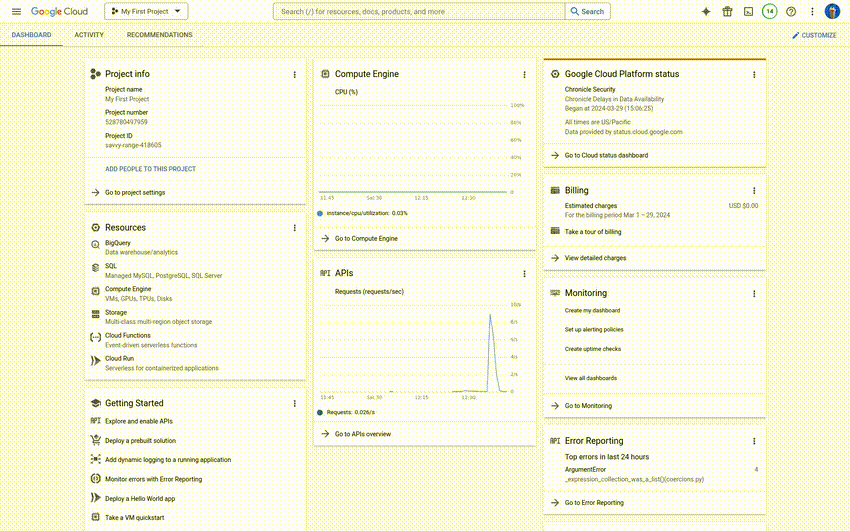
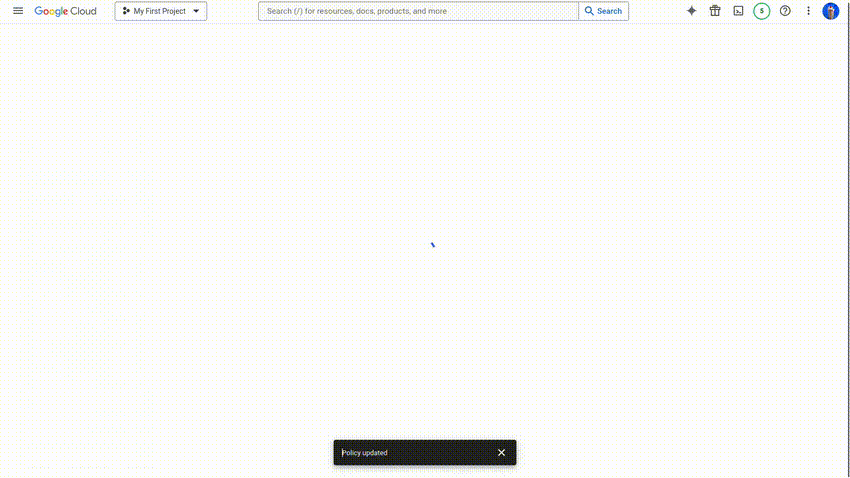
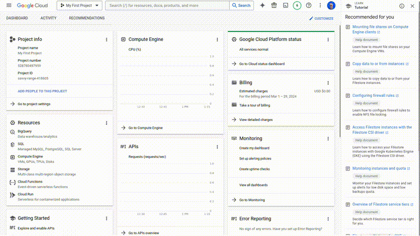
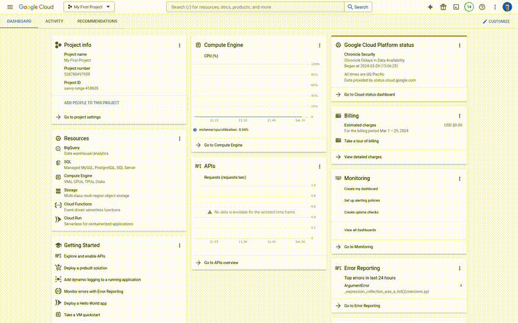
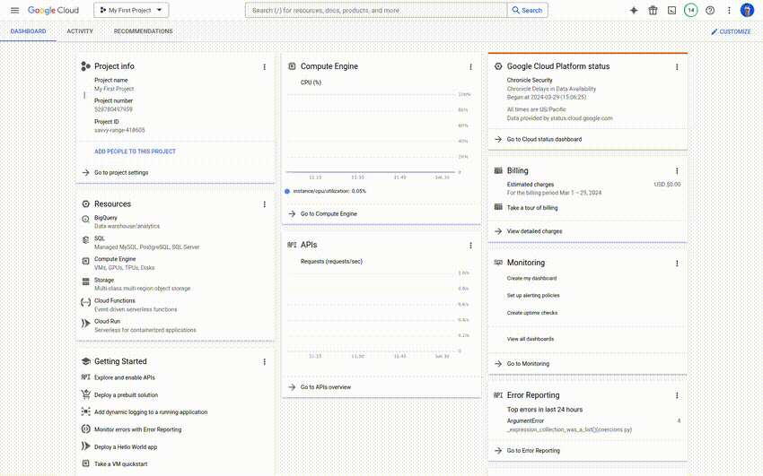
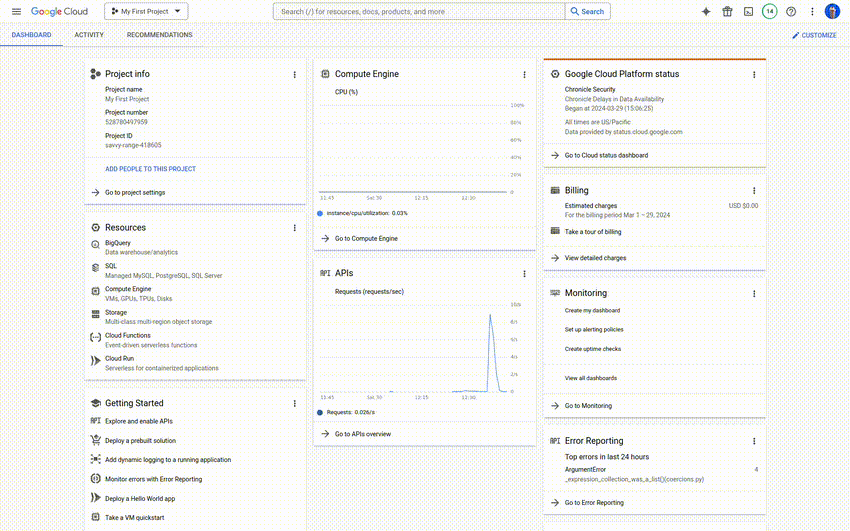
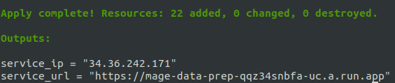
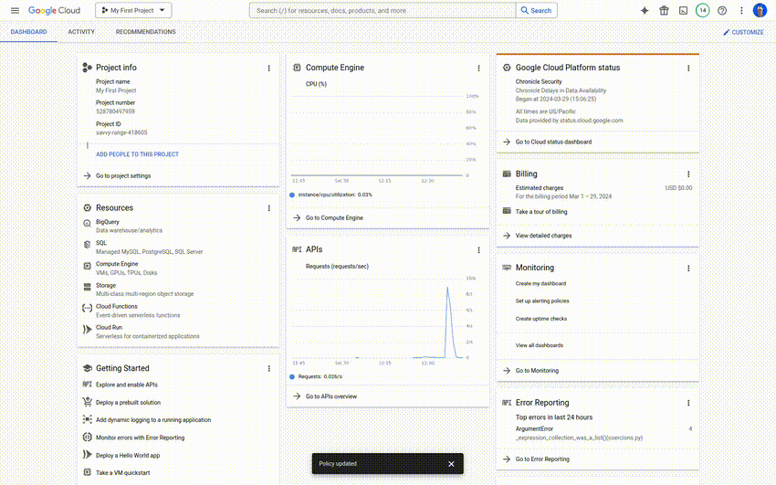
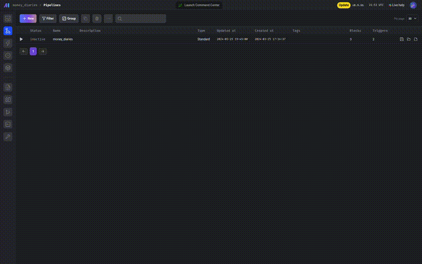
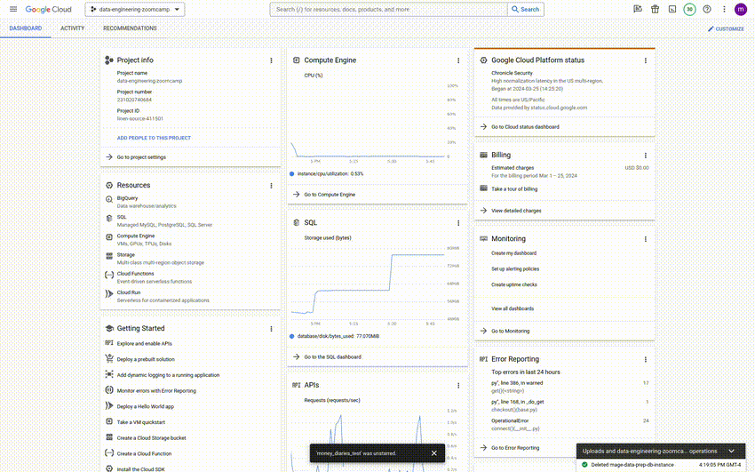

> ℹ️ Tip: There are a lot of steps involved in creating this data pipeline and dashboard. I suggest going over the instructions first to get a feel for the process.

## Prerequisite

To install the prerequisites you can follow the instructions [here](./setup.md) 

The project was created on an Ubuntu machine. If you are using a different OS you can find more details on how to install these tools here:

1. [GCloud](https://cloud.google.com/sdk/docs/install)
2. [GCP account](https://cloud.google.com/free)
3. [terraform](https://developer.hashicorp.com/terraform/tutorials/aws-get-started/install-cli)
4. [Docker](https://docs.docker.com/engine/install/)
5. [dbt](https://docs.getdbt.com/docs/core/connect-data-platform/bigquery-setup)
6. [Streamlit](https://docs.streamlit.io/get-started/installation)


## Permissions

Make sure that the following permissions are granted to either your main GCP account or a service accout:

- Artifact Registry Admin
- Cloud Run Developer
- Cloud SQL Admin
- Service Account Token Creator
- Secret Manager Secret Accessor
- BigQuery Admin (BigQuery)



## APIs

Make sure that the following APIs are enabled

- **Cloud Filestore API**



- **Serverless VPC Access API**



## BigQuery Credentiacls

To allow Mage.ai to access your BigQuery warehouse you will need to create a BigQuery credentials secret file and grant the account that will be used by terraform access to it. You can follow these instructions to do so:

### Create JSON Key File

To create a JSON key file for an already existing Google Service Account, follow these steps:

1. **Go to the IAM & Admin page**:
   - On the left sidebar, click on the "IAM & Admin" menu item, then click on "Service Accounts"

2. **Create a key**:
   - Click on the service account you want to create a key for
   - Go to the "KEYS" tab
   - Click on the "ADD KEY" button, then click on "Create new key"
   - By default, JSON is the chosen key type, keep it
   - Click "Create". This will download the JSON key file to your local machine



### Create Secret

To create a secret in Google Cloud Secret Manager, follow these steps:

1. **Navigate to Secret Manager**: 
    - On the left sidebar, navigate to the "Secret Manager" section. You can find it under the "Security" category

2. **Create a new secret**:
   - Click on the "Create Secret" button
   - In the name field enter "bigquery_credentials"

3. **Add the secret value**:
   - In the "Add Secret Version" page, choose the method to add the secret value. You can either paste the value directly or upload a file
   - Paste the contents of / upload the JSON file downloaded in the previous step

4. **Save the secret**: 
    - Once you've added the secret value, click "Create" or "Save" to create the secret

5. **Verify creation**: 
    - After creation, you can verify that your secret has been created successfully by navigating to the "Secret Manager" dashboard and ensuring that "bigquery_credentials" appears in the list of secrets



### Grant Permission

To grant a Google Service Account access to the "bigquery_credentials" secret created in Secret Manager, follow these steps:

1. **Navigate to the Secret Manager page**:
   - Open the Google Cloud Console in your web browser
   - On the left sidebar, click on "Secret Manager" under the "Security" section

2. **Select your secret**:
   - Click on the name of the secret that you want to grant access to
   - This will open the details page for the selected secret

3. **Go to the Permissions tab**:
   - In the secret details page, click on the "Permissions" tab

4. **Add a member**:
   - Click on the "+ Add member" button to add a new member
   - In the "New members" field, enter the email address of the Google Service Account to which you want to grant access (choose one that has the BigQuery Admin permission)
   - Choose the role "Secret Manager Viewer" from the dropdown list

5. **Review and save**:
   - Review the permissions you've set to ensure they're correct
   - Click on the "Save" button to apply the changes



## Run 

### Prepare enviornment

- **Clone the repo**

```bash
git clone https://github.com/el-grudge/money-diaries.git
cd money-diaries
```

- **Export the following environment variables**

Change the values of the following environment variables or set them in the [`variables.tf`](../terraform/variables.tf) file

```bash
export GOOGLE_PROJECT="project-name"
export GOOGLE_PROJECT_ID="project-id"
export GCP_REGION="region"
export GCP_ZONE="zone"
export GCP_LOCATION="location"
export DB_PASSWORD="database_password"
```
ℹ️ Tip: The `DB_PASSWORD` parameter is for the Postgres database that will be used by Mage.ai's internal operations. This is different from the BigQuery data warehouse that will be used to store the data for the dashboard. 

### Terraform

- **Authentication**
```bash
gcloud init
gcloud auth application-default login
```

- **`terraform init `**
```bash
cd terraform
terraform init
```

- **`terraform plan`**
```bash
terraform plan \
  -var="project=${GOOGLE_PROJECT}" \
  -var="project_id=${GOOGLE_PROJECT_ID}" \
  -var="region=${GCP_REGION}" \
  -var="zone=${GCP_ZONE}" \
  -var="location=${GCP_LOCATION}" \
  -var="database_password=${DB_PASSWORD}"
```

- **`terraform apply`**
```bash
terraform apply \
  -var="project=${GOOGLE_PROJECT}" \
  -var="project_id=${GOOGLE_PROJECT_ID}" \
  -var="region=${GCP_REGION}" \
  -var="zone=${GCP_ZONE}" \
  -var="location=${GCP_LOCATION}" \
  -var="database_password=${DB_PASSWORD}"
```

Terraform will deploy Mage.ai as a Google Clound Run service, and the `terraform apply` command will output the url to the access the service after it finishes running



In the `main.tf` file, access to the Mage.ai service is configured to accept external traffic by default. To disable external traffic navigate to Cloud Run on the left sidebar, click on the mage-data-prep service, go to the Networking tab, then under Ingress Control choose Internal, and click Save.



When you go to the Mage.ai service url, you'll find the money_diaries pipeline already created. To run the pipeline, click on it. This will take you to the "Triggers" page where you will find the "Run@Once" button (the middle button in the upper panel). Press on it, then press on the "Run Now" button in the "Run Pipeline Now" pop-up window. You can view the log of the current run by going to "Runs" page on the left sidebar and clicking on the logs logo next to the Running pipeline



The pipeline will extract the posts on the Money Diaries blog home page only. If you want to extract more posts, checkout the instructions in the terraform [README](../mage_data/README.md) file. The pipeline loads the extracted data into a BigQuery dataset called money_diaries. You can view the dataset by navigating to BigQuery on the left sidebar, then click on BigQuery Studio. Once the Explorer loads, expand it to load the datasets and locate the `money_diaries` dataset. If you have executed the ingestion pipeline, you should find the data loaded in the dataset.



To delete these resources, run the `terraform destroy` command:

- **`terraform destroy`**
```bash
terraform destroy \
  -var="project=${GOOGLE_PROJECT}" \
  -var="project_id=${GOOGLE_PROJECT_ID}" \
  -var="region=${GCP_REGION}" \
  -var="zone=${GCP_ZONE}" \
  -var="location=${GCP_LOCATION}" \
  -var="database_password=${DB_PASSWORD}"
```

⚠️ Note: Sometimes resources take a bit too long to be destroyed, which may interrupt the destroy operation. If you see an error such as "role 'xyz' cannot be dropped because some objects depend on it" or "'resource' is still in use", wait a few minutes then rerun the `terraform destroy` command. If that does not fix it, you may need to delete the resources manually.

### dbt

ℹ️ Tip: If you've already authenticated your gcloud account for terraform you can skip the dbt authentication step.

- **Authentication**

```bash
gcloud auth application-default login \
  --scopes=https://www.googleapis.com/auth/bigquery,\
https://www.googleapis.com/auth/drive.readonly,\
https://www.googleapis.com/auth/iam.test
```

- **Initiate dbt**

```bash
cd ../dbt
dbt init
```
tip about my_bigquery_profile
....


- **Install dbt packages**

```bash
dbt deps
```

- **Build the models**

```bash
dbt build
```

- (Optional) **Run the models**

```bash
dbt run --vars '{'is_test_run': 'false'}'
```

### Dashboard

ℹ️ Tip: If you've already authenticated your gcloud account, and you're running the dashboard locally in the same session and don't plan to deploy it to the cloud, then you can skip the authentication step, otherwise follow the authentication instructions below.

- **Authentication**

Rename the streamlit directory

```bash
mv secrets.streamlit .streamlit
```


The .streamlit directory has the secrets.toml file which contains the Google cloud credentials that will be used to connect to BigQuery.

Modify the contents of the key file by adding the values from the keys JSON file

```
# .streamlit/secrets.toml

[gcp_service_account]
type = "service_account"
project_id = "xxx"
private_key_id = "xxx"
private_key = "xxx"
client_email = "xxx"
client_id = "xxx"
auth_uri = "https://accounts.google.com/o/oauth2/auth"
token_uri = "https://oauth2.googleapis.com/token"
auth_provider_x509_cert_url = "https://www.googleapis.com/oauth2/v1/certs"
client_x509_cert_url = "xxx"
```

- **Run**

Run the streamlit app to launch the dashboard. This command has to be executed from the project home path

```bash
cd ../
streamlit run streamlit-moneydiaries/app.py
```

To view the dashboard, go to https://localhost:8501
